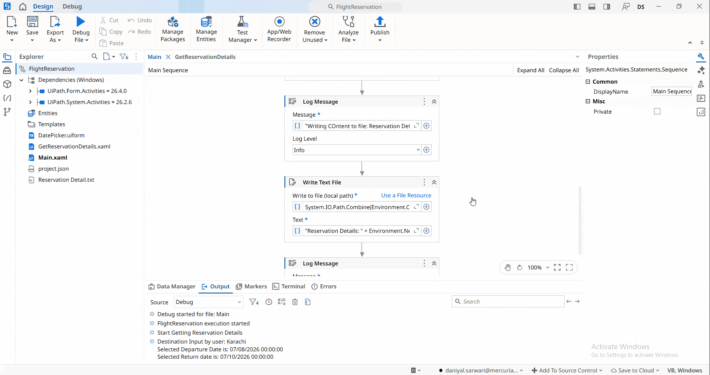

## Simple Flight Reservation

A **UiPath** automation that simulates a **flight reservation** by collecting user input for the **destination**, **departure date**, and **return date**.

The project demonstrates the use of **arrays** by storing the reservation details in a single array variable. It also showcases **file handling** and **forms handling** by getting the date from the form and generating a text file that confirms the user's reservation using the values stored in the array.

**Output:** A text file containing the reservation confirmation, including the destination, departure date, and return date.

> **Note:** This project is a practice exercise completed by following the UiPath Academy course **[Variables, Constants, and Arguments](https://academy.uipath.com/courses/variables-constants-and-arguments-in-studio-v2024-10)**.

