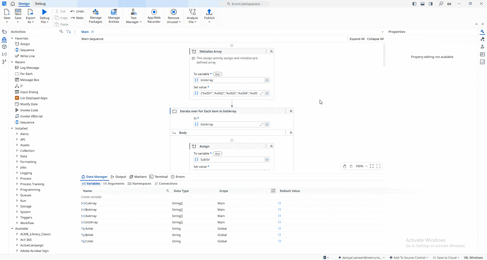

## Separate Error Codes Using Switch

A **UiPath** automation that separates a collection of **error codes** into different arrays based on their type (**"Ax"**, **"Bx"**, or **"Cx"**).

The project demonstrates the use of **Assign**, **For Each**, **Switch**, and **Array/List** activities by iterating through an array of error codes, identifying the prefix of each code (`Ax`, `Bx`, or `Cx`), and storing it in the corresponding array. After processing all error codes, the application displays the contents of each array in the **Output** panel.

> **Note:** This project is a practice exercise completed by following the UiPath Academy course **[Control Flow in Studio (v2024.10)](https://academy.uipath.com/courses/control-flow-in-studio-v2024-10)**.

### Initial Data

The automation starts with the following array of error codes:

```vb
{"Ax001","Ax002","Ax003","Ax004","Ax005",
 "Bx001","Bx002","Bx003",
 "Cx001","Cx002","Cx003","Cx004"}
```

