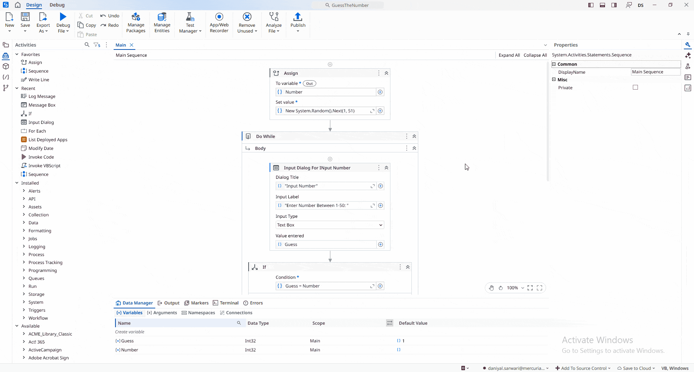

## Guess the Number

A **UiPath** automation where the user attempts to guess a **secret number** between **1 and 50** within **three attempts**.

The project demonstrates the use of **Assign**, **Input Dialog**, **If**, and **Do While/Loop** activities by prompting the user to enter a guess, comparing it with the predefined secret number, and providing feedback after each attempt. If the guess is correct, the user is notified immediately. After all attempts are used (or the correct number is guessed), the application displays the **correct secret number** in a **Message Box**.

> **Note:** This project is a practice exercise completed by following the UiPath Academy course **[Control Flow in Studio (v2024.10)](https://academy.uipath.com/courses/control-flow-in-studio-v2024-10)**.

