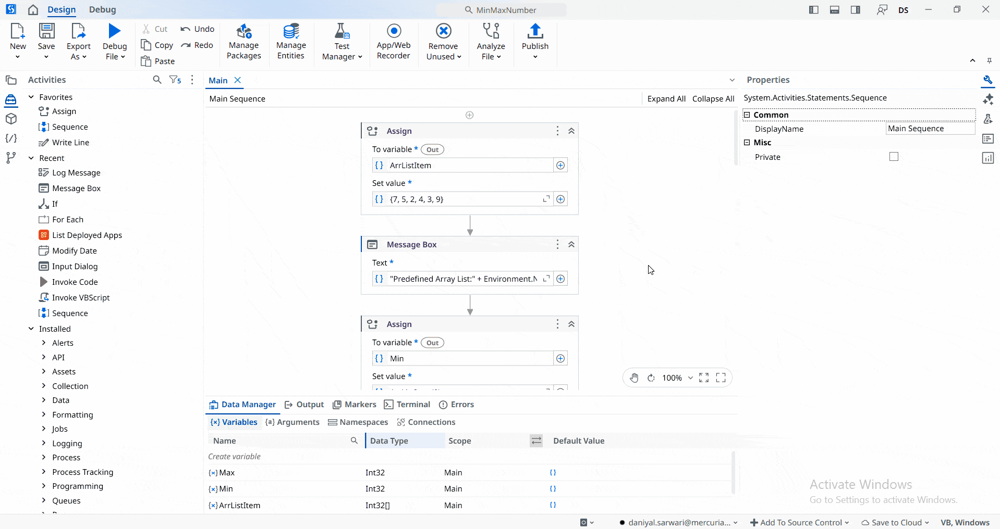

## Minimum and Maximum Array Finder

A **UiPath** automation that determines the **minimum** and **maximum** values in a predefined integer array.

The project demonstrates the use of **Assign**, **For Each**, and **If** activities by iterating through an **Int32** array, comparing each value with the current minimum and maximum, and updating them when necessary. After processing the entire array, the application prints the **minimum** and **maximum** values to the **Output/Message Box** panel.

> **Note:** This project is a practice exercise completed by following the UiPath Academy course **[Control Flow in Studio (v2024.10)](https://academy.uipath.com/courses/control-flow-in-studio-v2024-10)**. 

