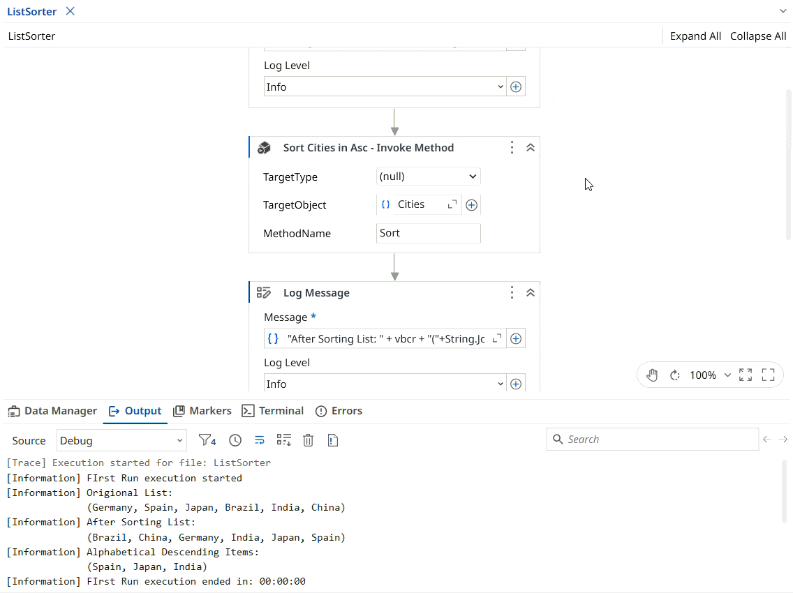

# Sort List and Print Three Descending Values

A **UiPath** automation that sorts a list of countries alphabetically and prints the first three values in descending order in the Output Panel.

The project demonstrates how to work with **lists** in UiPath by initializing a list of country names, sorting the list alphabetically, selecting the first three values, and displaying them in descending order.

### List Initialization

Use the following value for the List initialization:

```vb
New List(Of String) From {"Germany", "Spain", "Japan", "Brazil", "India", "China"}
```

> Output: (“Spain, Japan, India”).

> Note: This project is a practice exercise completed by following the UiPath Academy course – **Data Manipulation with Lists and Dictionaries in Studio (v2024.10).**

