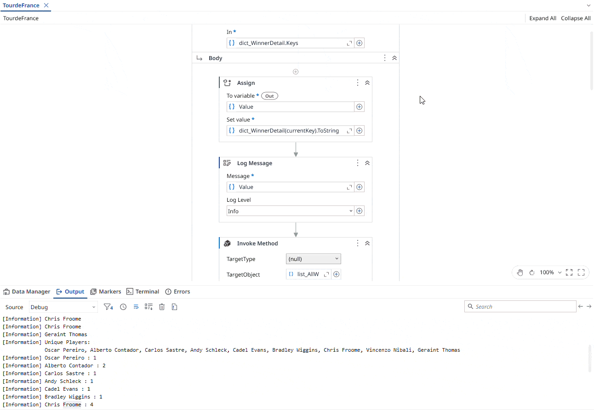

# Calculate and Print Tour de France Victories

A **UiPath** automation that calculates and displays the number of victories achieved by each **Tour de France** winner using a dictionary.

The project demonstrates how to work with **dictionaries** in UiPath by storing each Tour de France year along with its corresponding winner, calculating the number of victories for each winner, and displaying every winner's name with their corresponding number of victories in the Output Panel.

### Dictionary Initialization

Use the following value for the Dictionary initialization:

```vb
New Dictionary(Of Int32, String) From {
    {2006, "Oscar Pereiro"},
    {2007, "Alberto Contador"},
    {2008, "Carlos Sastre"},
    {2009, "Alberto Contador"},
    {2010, "Andy Schleck"},
    {2011, "Cadel Evans"},
    {2012, "Bradley Wiggins"},
    {2013, "Chris Froome"},
    {2014, "Vincenzo Nibali"},
    {2015, "Chris Froome"},
    {2016, "Chris Froome"},
    {2017, "Chris Froome"},
    {2018, "Geraint Thomas"}
}
```

> Note: This project is a practice exercise completed by following the UiPath Academy course – **Data Manipulation with Lists and Dictionaries in Studio (v2024.10).**

