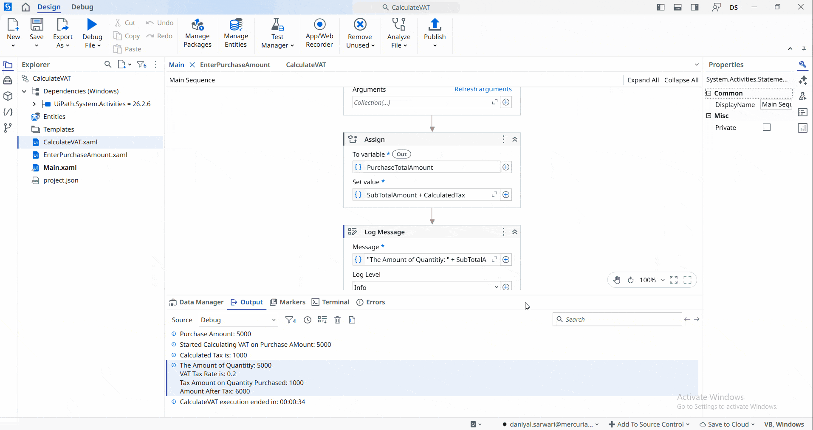

## Simple VAT Calculator
A **UiPath** automation that calculates **Value Added Tax (VAT)** for a user-entered purchase amount using a fixed **VAT rate of 20% (0.2)**.

The project demonstrates the use of **multiple workflows**, **global variables**, and **global constants** by separating the user input and VAT calculation into independent workflows. The main workflow invokes both workflows without passing **In/Out arguments**, relying instead on shared global resources. After calculating the VAT, the application displays both the **VAT amount** and the **total amount including VAT** in a message box.

> **Note:** This project is a practice exercise completed by following the UiPath Academy course **[Variables, Constants, and Arguments](https://academy.uipath.com/courses/variables-constants-and-arguments-in-studio-v2024-10)**.

