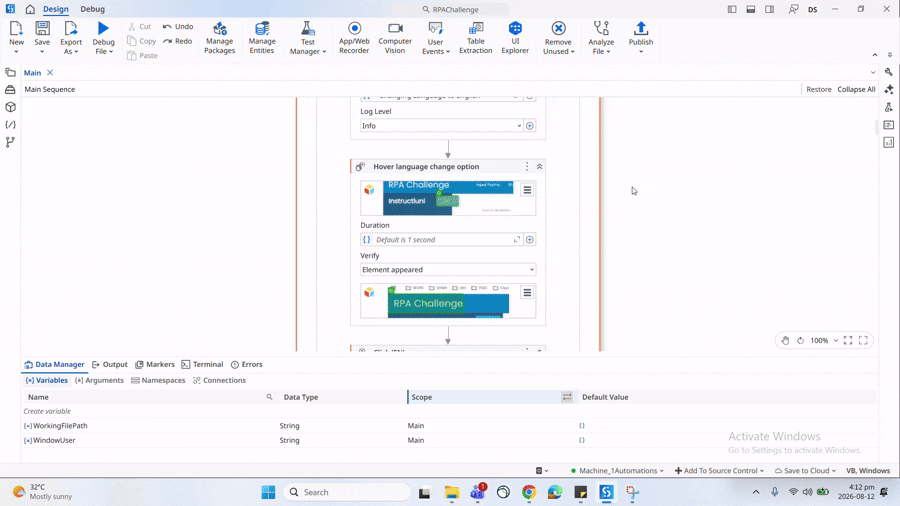

# RPA Challenge - UiPath

A **UiPath** automation for the [RPA Challenge](https://rpachallenge.com/).

## Overview

The workflow downloads the challenge Excel file, reads the data into a **DataTable**, iterates through each row, and enters the corresponding values into the web form.

The challenge form dynamically changes the position of its fields after each submission, requiring the automation to correctly identify each field during every round.

## Workflow

1. Download `challenge.xlsx` to:
   `C:\Users\<USER>\Documents\RPAChallenge\challenge.xlsx`
2. Read the Excel file into a DataTable.
3. Iterate through each DataTable row.
4. Enter the row values into the corresponding form fields.
5. Submit the form for all records.
6. Complete the 10-round RPA Challenge.

## Technologies

- **UiPath Studio**
- **Excel / DataTable**
- **Web UI Automation**

>Ready To Deploy Package File ___RPAChallenge.1.0.1.nupkg___

