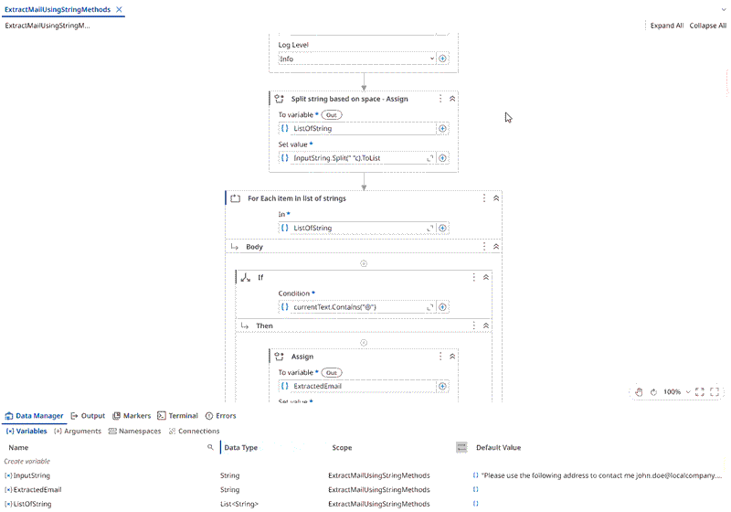

# String Email Extraction

A **UiPath** automation that extracts and displays an email address from a given string using **string manipulation methods**.

The project demonstrates how to work with strings in UiPath by using string methods to locate and extract the email address from a larger text string. The workflow takes a predefined string value as input, extracts the email address, and displays the result in a message box.

## Use-case / Problem Statement

Create a workflow to extract and display the email address from a string using string methods.

### Input String

```text
Please use the following address to contact me john.doe@localcompany.com on the company email.
```
>Note: This project is a practice exercise completed by following the UiPath Academy course Data Manipulation with Strings in Studio (v2024.10).

