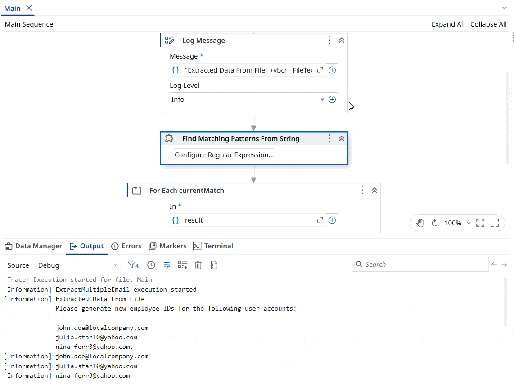

# String Email Extraction

A **UiPath** automation that extracts multiple email addresses from a template file using **regular expressions (Regex)**.

The project demonstrates how to use Regex in UiPath to identify and extract multiple email addresses from text. The workflow reads the provided (input file) `Template.txt` file, finds all email addresses contained in the text, and extracts them for further processing or display.

> Note: This project is a practice exercise completed by following the **UiPath Academy course – Data Manipulation with Strings in Studio (v2024.10).**

