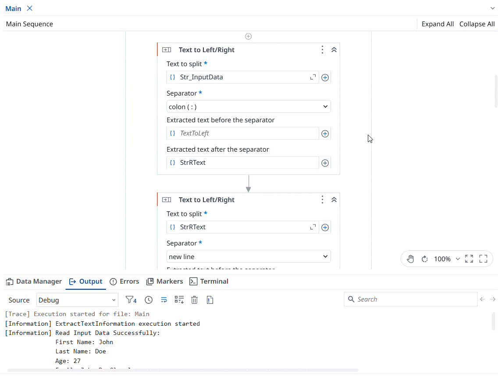

# Employee Name Extraction and Invitation Message

A **UiPath** automation that extracts the **First Name** and **Last Name** of an employee from a text file using **string manipulation activities** and uses the extracted information to personalize an invitation message.

The project demonstrates how to work with string activities in UiPath to read employee details from a text file, extract the first and last name, and replace the corresponding placeholders in the following message:

> "Hello Mr/Ms/Mrs \<first_name> \<last_name>, we would like to invite you to our product launch event next week. Please confirm by the end of current week."

**Note:** This project is a practice exercise completed by following the **UiPath Academy course – Data Manipulation with Strings in Studio (v2024.10).**

