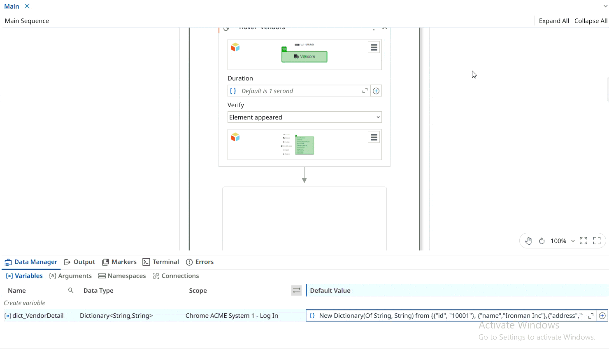

# Add New Vendor Details

A **UiPath** automation that checks whether the user is logged in to the [**ACME**](https://acme-test.uipath.com/login) application, navigates to the **Add New Vendor** section, enters the vendor details, and verifies that the vendor has been added successfully.

The project demonstrates the use of **Check App State** and **Verify Execution** features in UiPath to validate application states and confirm that the automation has completed the required actions successfully.


Use the **Check App State** and **Verify Execution** features to check if the user is logged in to the ACME page.

- If the user is **not logged in**, log an error message.
- If the user **is logged in**, navigate to **Vendor > Add New Vendor**.
- Enter the details of the new vendor.
- Verify that the vendor has been added successfully.

### Vendor Details

| Field | Value |
|---|---|
| Vendor ID | 10001 |
| Vendor Name | Ironman Inc |
| Vendor Address | 1 MG Road |
| Vendor City | Bengaluru |
| Vendor Country | India |

### Dictionary Initialization

Use the following value for the Dictionary initialization:

```vb
New Dictionary(Of String, String) From {
    {"id", "10001"},
    {"name", "Ironman Inc"},
    {"address", "1 MG Road"},
    {"city", "Bengaluru"},
    {"country", "India"}
}
```
> Note: This project is a practice exercise completed by following the UiPath Academy course – __UI automation synchronization with Studio (v2024.10).__

