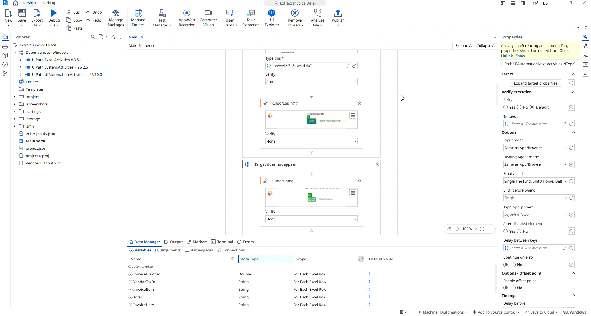

## Invoice Details Extraction

A **UiPath** automation that extracts invoice details from the **ACME website** using the **Modern Design Experience**. The process reads invoice numbers from an input Excel file, searches for each invoice on the ACME website, extracts the required invoice information, and stores the results in an Excel file.

The project demonstrates the use of **modern UI automation activities** to interact with web applications, along with **Excel activities** to read and write data. For each invoice number, the automation searches the ACME website and extracts details including the **vendor tax ID, invoice item, total amount, and invoice date**. The extracted information is then written to an output Excel file stored in the project folder.

> **Note:** This project is a practice exercise completed by following the UiPath Academy course **[User Interface (UI) Automation with Modern Design in Studio (v2024.10)](https://academy.uipath.com/courses/user-interface-ui-automation-with-modern-design-in-studio-v2024-10)**.

