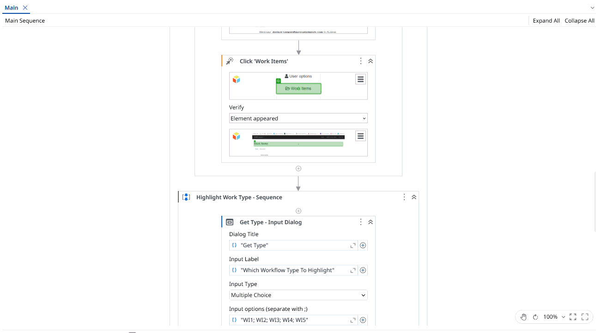

# Highlight WFT Type Items on ACME

A **UiPath** automation that navigates to the **Work Items** page in the ACME application and highlights Type cells that match a workflow type selected by the user.

The project demonstrates how to work with **Visual Tree Hierarchy and Find Children Selectors** in UiPath by using dynamic selector attributes to identify and interact with specific elements in a web table.

## Use-case / Problem Statement

Create a process that navigates to the **Work Items** page in ACME and highlights all matching **Type** cells on the first page of the table.

The workflow performs the following steps:

1. Ask the user which workflow type to highlight (**WI1, WI2, WI3, WI4, or WI5**).
2. Navigate to the ACME **Work Items** page:
   `https://acme-test.uipath.com/work-items`
3. Iteratively identify and highlight all cells in the **Type** column on the first page that match the user's selected workflow type.

> **Note:** This project is a practice exercise completed by following the **UiPath Academy course – Selectors in Studio Deep Dive (v2024.10)**.

