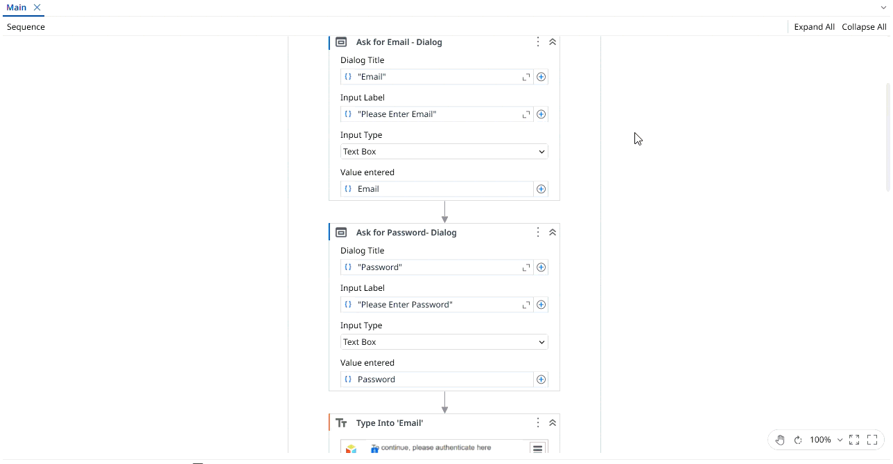

## Work Items Table Extraction

A **UiPath** automation that extracts work item details from the **ACME website** using the **Modern Design Experience**. The process asks the user to provide their email and password, logs into the ACME website, navigates to the Work Items page, extracts data from the work items table, and stores the results in an Excel file.

The project demonstrates the use of **modern UI automation activities** to interact with web applications, along with **Workbook activities** to write the extracted data to Excel. The automation extracts the following information from the work items table: **WIID, description, type, status, and date**. The extracted data is then written to an Excel file stored in the project folder using the **Write Range** activity.

> **Note:** This project is a practice exercise based on the UiPath Academy course **[User Interface (UI) Automation with Modern Design in Studio (v2024.10)](https://academy.uipath.com/courses/user-interface-ui-automation-with-modern-design-in-studio-v2024-10)**.

