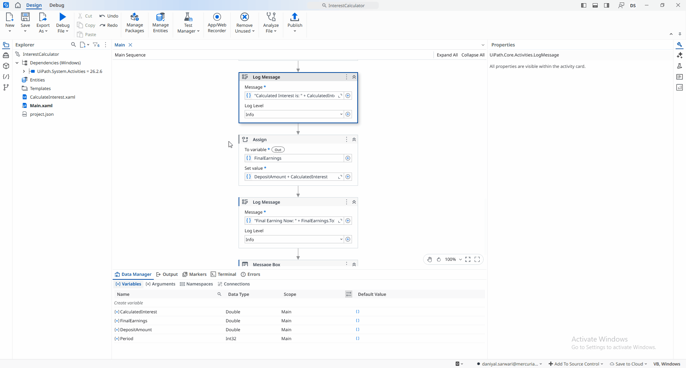

## [Simple Interest Calculator](./interest_calculator/)
A **UiPath** automation that calculates **simple interest** based on a user-entered initial deposit and a selected investment period (**1, 3, or 5 years**).

The project demonstrates the use of **multiple workflows** and **workflow arguments** by separating the calculation logic from the main workflow. Using a fixed annual interest rate of **1.75%**, the application calculates the accumulated interest, returns the result to the main workflow, and displays both the **total interest earned** and the **final deposit balance** in a message box.
> **Note:** This project is a practice exercise completed by following the UiPath Academy course **[Variables, Constants, and Arguments](https://academy.uipath.com/courses/variables-constants-and-arguments-in-studio-v2024-10)**.

