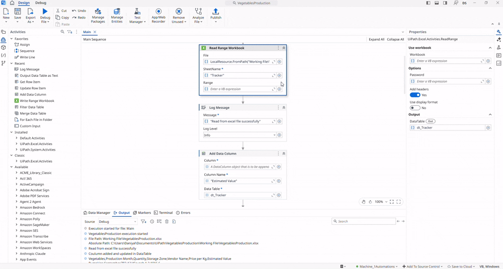

## Product Value Estimator

A **UiPath** automation that reads product data from an existing **Excel workbook**, calculates the **estimated value** of each product, and writes the updated data to a **new worksheet**.

The practice project demonstrates the use of **Workbook** and **DataTable** activities to process Excel data without requiring Microsoft Excel to be installed. It reads product information from the input workbook, adds a new column named **Estimated Value**, calculates the value by multiplying **Quantity** by **Price per Kg** for each record, and saves the updated DataTable into a newly created worksheet within the same workbook.

> **Note:** This project is a practice exercise completed by following the UiPath Academy course **Excel Automation with the Modern Experience in Studio**.

